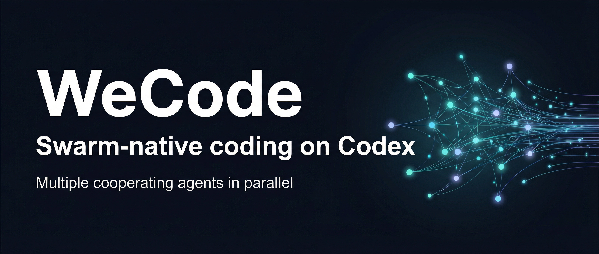
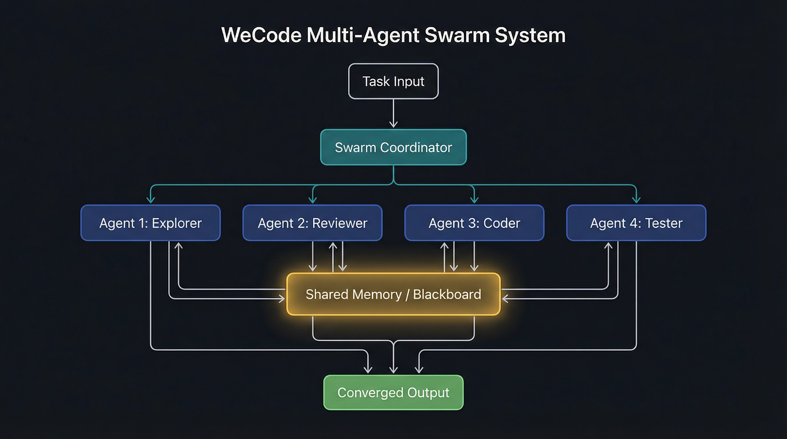
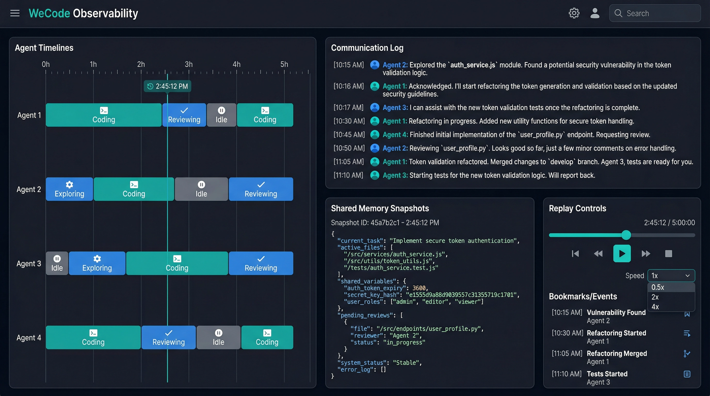

# wecode

Language / 语言: **English** | [中文速览](#chinese-summary)

<div align="center">
  
  <br />
  <br />
  <a href="https://github.com/wmjwmj100/wecode/releases"></a>
  <a href="https://github.com/wmjwmj100/wecode"></a>
  
  
  
  
  
  <br />
  <br />
  <strong>Swarm-native coding on Codex.</strong>
  <br />
  WeCode runs agents as peers: direct agent-to-agent communication plus a shared blackboard, not a brittle planner-worker tree.
  <br />
  <br />
  <a href="https://github.com/wmjwmj100/wecode/releases">Download Binary</a>
  ·
  <a href="#why-swarm-not-one-agent">Why Swarm</a>
  ·
  <a href="#how-the-swarm-executes">Architecture</a>
  ·
  <a href="#benchmark-snapshot">Benchmark</a>
  ·
  <a href="#quick-start">Quick Start</a>
</div>

> README visuals are now sourced from the generated images in [`images/`](./images).

---

## Built For Hard Engineering Work

WeCode is a multi-agent coding system built on Codex for teams that care about execution speed, collaboration quality, and delivery stability. Instead of forcing one model to plan, inspect, code, test, and review in a single chain, WeCode lets a swarm of agents split the work, message each other directly, write to shared memory, and cross-check each other before converging on an answer.

The key architectural claim is simple: strong collaboration does not look like a tree. Human teams do not route every question, blocker, or correction through one manager. They talk laterally, keep shared notes, challenge each other, and re-form around the task. WeCode is built around that same advantage.

<table>
  <tr>
    <td width="33%" valign="top">
      <strong>Parallel reconnaissance</strong><br />
      Multiple agents inspect different parts of the codebase at the same time, which reduces blind spots and shortens time-to-context.
    </td>
    <td width="33%" valign="top">
      <strong>Shared working memory</strong><br />
      Findings are written into a common space so later agents can start from the current state of understanding instead of rebuilding it.
    </td>
    <td width="33%" valign="top">
      <strong>Peer-to-peer coordination</strong><br />
      Agents do not have to relay everything through a root planner. They can directly ask, challenge, warn, and synchronize with each other.
    </td>
  </tr>
</table>

## Why Swarm Not One Agent?

Most coding agents are still one model wearing many hats. Even many "multi-agent" systems are still planner-worker trees in disguise: one top-level agent delegates, everyone reports upward, and lateral correction is weak or absent. That works for short, local edits, but performance degrades when the task becomes ambiguous, cross-cutting, or unfamiliar. WeCode is designed for the cases where a single uninterrupted reasoning trace or a single coordination bottleneck becomes the failure mode.

| Problem Shape | Tree / Single-Agent Flow | WeCode Swarm |
|---|---|---|
| Small bug fix | Usually fast | Usually fast |
| Unknown codebase | Sequential exploration | Parallel repo reconnaissance |
| Multi-file refactor | Context becomes fragile | Agents divide scope and compare notes |
| Architecture change | One chain loses the thread | Shared memory preserves the big picture |
| Ambiguous requirement | First interpretation tends to stick | Disagreement surfaces early |
| Coordination topology | Planner-to-worker or solo trace | Peer-to-peer agents plus blackboard |

## Peer Network, Not A Tree

Traditional multi-agent coding stacks usually behave like org charts: one planner decomposes work, workers execute, and information climbs back up the same chain. That structure is easy to reason about, but it creates exactly the bottlenecks you would expect:

- The planner becomes the throughput ceiling.
- Workers discover things that should affect peers, but the signal has to travel upward before it can travel sideways.
- Local disagreements get flattened too early, so weak assumptions survive longer than they should.

WeCode is built around a different coordination model:

- **Agent-to-agent first:** any agent can directly contact another when it finds a dependency, blocker, contradiction, or relevant clue.
- **Shared blackboard second:** durable findings are written into common memory so the rest of the swarm can re-anchor on the latest state.
- **Human-like collaboration advantage:** this combines private conversations with public team memory, which is much closer to how strong engineering teams actually work.

The result is not just "more agents." It is a step change in how collaboration happens. Instead of one lead mind serializing the whole task, WeCode behaves more like a high-performance team: specialists form local loops, synchronize through shared notes, and correct each other before the final answer hardens.

## How the Swarm Executes

<p align="center">
  
</p>

1. **Split the search space.** Agents explore different files, hypotheses, and failure modes in parallel.
2. **Talk laterally.** Agents message each other directly when a discovery should change someone else's work right now.
3. **Write to the blackboard.** Durable findings are published to shared memory so the whole swarm can build on them.
4. **Cross-check before converge.** Proposed fixes are challenged by peers instead of being accepted by default.
5. **Return one coherent result.** The user sees a single output backed by distributed investigation.

### Coordination Patterns We Care About

- **Spontaneous role division:** agents naturally specialize when duplicate work becomes wasteful.
- **Proactive unblocking:** one agent often provides missing context before another explicitly asks.
- **Self-correction through critique:** weak assumptions are more likely to be exposed before they reach the user.
- **Adaptive planning:** collaboration order emerges from the task instead of being hard-coded into a rigid pipeline.

## Observability

<p align="center">
  
</p>

WeCode is designed to make collaboration legible, not hidden. The current public presentation focuses on four things:

- **Per-agent timelines:** inspect what each agent was doing and when it switched focus.
- **Agent-to-agent communication log:** see direct messages, blockers, escalation, and handoffs across the swarm.
- **Shared-blackboard snapshots:** understand what the colony collectively knew at each stage.
- **Replay-friendly traces:** reconstruct how the final answer emerged from parallel work.

<details>
  <summary><strong>Design note</strong></summary>

WeCode does not depend on a fixed planner-worker template. The coordination layer is closer to MARL-style adaptation: agents react to the changing task state, each other, direct agent-to-agent messages, and the shared workspace rather than obeying one pre-written script.

</details>

## Benchmark Snapshot

WeCode now posts **86.9%** and holds **#1** in this public benchmark snapshot. The point is not only raw model quality. The point is that collaboration architecture materially changes how well the system handles broad, messy engineering tasks.

| Rank | System | % Resolved |
|---:|---|---:|
| **1** | **WeCode (multi-agent on Codex)** | **86.90** |
| 2 | Opus 4.5 | 80.90 |
| 3 | Opus 4.6 | 80.80 |
| 4 | GPT-5.2 (all models) | 80.00 |
| 5 | Sonnet 4.5 | 77.20 |
| 6 | Gemini 3 Pro | 76.20 |

> Competitor scores in this snapshot were updated from the user-provided comparison image on April 2, 2026.

## Quick Start

```powershell
# 1) Download the latest Windows binary from Releases
# 2) Launch WeCode
.\wecode-windows-x64.exe

# 3) Give the swarm a concrete engineering goal
#    Example: fix a failing test, inspect a regression, or plan a refactor
```

Current public distribution:

- Windows x64 binary via [GitHub Releases](https://github.com/wmjwmj100/wecode/releases)
- Binary publishing notes in [BINARY_UPLOAD.md](./BINARY_UPLOAD.md)

## Roadmap

- [x] Core swarm runtime
- [x] Shared blackboard communication
- [x] Readable cross-agent execution traces
- [ ] Web UI for live swarm observation
- [ ] Custom specialist profiles
- [ ] Strategy self-critique during long-horizon runs
- [ ] Domain packs for analysis-heavy workflows, including finance
- [ ] Multi-repo task execution

## Contributing

WeCode is still early. The most useful contributions right now are concrete failures, surprising coordination wins, and trace-backed bug reports.

- Open issues: [github.com/wmjwmj100/wecode/issues](https://github.com/wmjwmj100/wecode/issues)
- Follow releases: [github.com/wmjwmj100/wecode/releases](https://github.com/wmjwmj100/wecode/releases)

<a id="chinese-summary"></a>

## Chinese Summary

WeCode 是一个基于 Codex 的多智能体编程系统。它不是让一个模型串行完成“理解代码、制定方案、修改、验证、复盘”全部流程，也不是传统的树状 planner-worker 分发结构，而是让多个智能体并行探索、直接彼此通信、写入共享黑板、互相校验，再汇总成一个最终结果。

### 中文速览

- **并行探索：** 多个智能体同时查看不同文件、路径和假设，缩短进入上下文的时间。
- **Agent to agent 通信：** 智能体之间可以直接沟通依赖、阻塞和分歧，不需要先汇报给上层再转发。
- **共享黑板：** 关键发现会写入公共工作区，后来加入的智能体不需要从零开始。
- **类人协作优势：** 这更接近强工程团队的工作方式，既有私下快速同步，也有公共知识沉淀和同伴纠错。
- **过程可见：** README 中的视觉区块预留了架构图、观测视图和后续截图位置，方便你继续补完整个 GitHub 首页。

### 中文快速开始

```powershell
# 1) 从 Releases 下载最新 Windows x64 二进制
# 2) 运行 WeCode
.\wecode-windows-x64.exe

# 3) 输入一个明确的工程目标开始使用
```

### 中文说明

- 当前 README 图片已切换到 `images/*.png`，后续可继续直接替换同路径文件。
- 当前基准部分已更新为 `86.9%` 和 `#1`，并按最新截图同步了对比榜单。
- 公共仓库暂时只保留高层说明，不展开内部实现细节。
